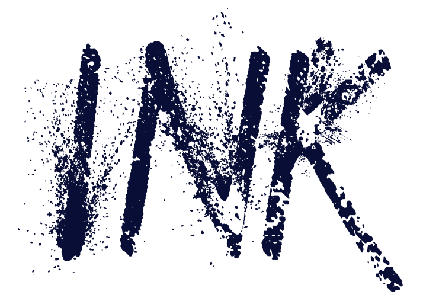

	

    
    
    

INK is a binary data structure for representing a knowledge graph (KG), taking into account nodes and their neighbourhoods till a certain, specified depth.

This repository contains:
* The code to transform a KG into the binary INK matrix representation
* The code INK Miner code: Semantic rule mining on the INK representation for both task-specific and task-agnostic use cases.

## Installation
* `pip install semantic-ink`
* or clone this repository
## Usage
See the [example notebook](https://github.com/IBCNServices/INK/blob/master/example.ipynb) for more information on how to use INK and the INK miner.
## Publications
Coming soon.
## Contributing
Pull requests are welcome.  
For major changes, please open an issue first to discuss what you would like to change.

## License
[IMEC](https://github.com/IBCNServices/INK/blob/master/LICENSE)
